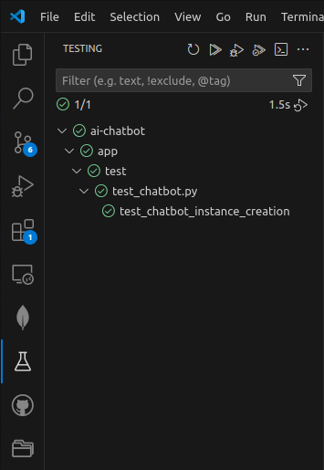

# Running the tests
The existing tests for this project can be run using the `Testing` tab in vscode

# Mocking with unittest.mock - getting started
- https://realpython.com/python-mock-library/
- https://docs.python.org/3/library/unittest.mock.html
- https://docs.python.org/3/library/unittest.mock-examples.html

## Where to patch
Before using `@patch` annotation from `unittest.mock` to mock dependencies, make sure you are familiar
with the following documents:
- https://realpython.com/python-mock-library/#knowing-where-to-patch
- https://docs.python.org/3/library/unittest.mock.html#where-to-patch

It's often not straightforward what module should be provided to `@patch` annotation to mock the correct
class/function.
Refer to a sample usage of this annotation in (app/test/test_chatbot.py)[app/test/test_chatbot.py] where you will notice that instead of mocking the module where the dependencies are defined actually
the module where they imported was used in @patch annotations.

# Mocking LangChain’s LLM Execution
Mocking LangChain’s LLM execution can be challenging because the `.invoke()` method cannot be easily mocked directly. 
Instead, the most effective approach is to mock the LLM itself.

Mocking LangChain properly requires more than just returning a fake response — you need to capture and validate prompts to ensure correctness.

LangChain provides [FakeListLLM](https://python.langchain.com/api_reference/core/language_models/langchain_core.language_models.fake.FakeListLLM.html), which returns predefined responses. 
However, it doesn’t store the prompt input. The missing feature can be added in a subclass.

LangChain also provides a fake embedding class. You can use this to test your pipelines.
https://python.langchain.com/docs/integrations/text_embedding/fake/

API Reference:[FakeEmbeddings](https://python.langchain.com/api_reference/community/embeddings/langchain_community.embeddings.fake.FakeEmbeddings.html)
