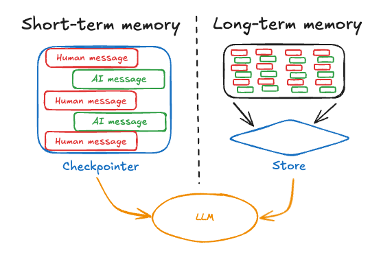

# Chatbot memory

## Requirements

Referring to past conversations, bringing up broader context.

Sample user prompts that should be supported:
- Can we go back to yesterday's conversation about ...
- Do you remember that idea we talked about some time ago? ...
- Remind me what things we were supposed to check in order to...
- Search the chat about ...
- Have we talked about this before?

## Implementation decisions

- Messages should be stored in a vector database to enable fast context retrieval for user queries.
- Converting message text to vector representation requires embeddings. For that OpenAI embeddings will be used but it should be possible to change embeddings provider in the future.
- Since the embeddings can change in the future the messages should also be stored in plain text so the conversion to vector form can be repeated at any time.
- For certain requirements the stored messages should include the following metadata: 
timestamp/date, session_id,

## LangChain way of implementing memory

- [LangChain message histoty HowTo](https://python.langchain.com/v0.2/docs/how_to/message_history/)
- [LangChain Essentials - Conversational Memory for OpenAI - LangChain](https://github.com/aurelio-labs/langchain-course/blob/main/chapters/04-chat-memory.ipynb)
- [MongoDBChatMessageHistory](https://python.langchain.com/docs/integrations/memory/mongodb_chat_message_history/)


### MongoDB (LangChain MongoDBChatMessageHistory)
Initial implementation (tags:1.x) was done around [MongoDBChatMessageHistory](https://python.langchain.com/docs/integrations/memory/mongodb_chat_message_history/#usage) class to store chat message history in a Mongodb database.

Chat messages are stored as a separate documents in chat/chat_history collection in mongodb database.

Sample document looks like this:
```json
{
  "_id": {
    "$oid": "68362bb02f4a7dd6650e7b40"
  },
  "SessionId": "254751de-538a-463f-a8a9-b69bfac3e560",
  "History": "{\"type\": \"human\", \"data\": {\"content\": \"How do you do?\", \"additional_kwargs\": {}, \"response_metadata\": {}, \"type\": \"human\", \"name\": null, \"id\": null, \"example\": false}}"
}
```
Database can be browsed with vscode mongodb extension that is available within devcontainer.


### Issues with using two storages for messages 
The way the Memory API is designed in LangChain is quite problematic. In order to meet the requirement of storing messages in two storages (MongoDB and a vector database), several rather inelegant workarounds were necessary, and the resulting code was poorly testable and hard to maintain.

```
LangChain was used in versions 1.x of ai-chatbot. In version 2.x it was replaced with LangGraph.
```


## LangGraph way of implementing memory
- [Comparison of LangChain and LangGraph way of implementing agents with memory](https://python.langchain.com/docs/how_to/migrate_agent/)
- [LangGraph Persistence](https://langchain-ai.github.io/langgraph/concepts/persistence/)

### LangGraph memory types

- [LangGraph memory concept](https://langchain-ai.github.io/langgraph/concepts/memory/)

`Short-term memory`, or thread-scoped memory, can be recalled at any time from within a single conversational thread with a user. LangGraph manages short-term memory as a part of agent's state. State is persisted to a database using a checkpointer so the thread can be resumed at any time. Short-term memory updates when the graph is invoked or a step is completed, and the State is read at the start of each step.

`Long-term memory` is shared across conversational threads. It can be recalled at any time and in any thread. Memories are scoped to any custom namespace, not just within a single thread ID. LangGraph provides stores (reference doc) to let you save and recall long-term memories.



In LangGraph:
- Short-term memory is also referred to as thread-level memory.
- Long-term memory is also called cross-thread memory.

A [thread](https://langchain-ai.github.io/langgraph/concepts/persistence/#threads) represents a sequence of related runs grouped by the same thread_id.

### Langraph persistence implementation how-to

https://langchain-ai.github.io/langgraph/how-tos/persistence/
https://langchain-ai.github.io/langgraph/agents/context/

### MongoDB (LangGraph Checkpointer) 
After migration to LangGraph (tags:2.x) the implementation of chat history was updated to use checkpointer [MongoDBSaver](https://python.langchain.com/docs/integrations/memory/mongodb_chat_message_history/#usage).

Chat messages, similarily to LangChain's MongoDBChatMessageHistory, are stored as a separate documents. Note that some fields are of BSON type, eg. binary representation of ChatMessage.

[BSON spec](https://bsonspec.org/spec.html), 

Sample document looks like this:
```json
{
  "_id": {
    "$oid": "6859bef720a416c9b33c8d78"
  },
  "checkpoint_id": "1f050743-8fe8-6f9a-bfff-b479841ef6d9",
  "checkpoint_ns": "",
  "thread_id": "c0eecbcc-ac73-49f3-9da5-f05baea2f2b4",
  "checkpoint": {
    "$binary": {
      "base64": "h6F2A6J0c9kgMjAyNS0wNi0yM1QyMDo1NDoxNS4xMTIwNTkrMDA6MDCiaWTZJDFmMDUwNzQzLThmZTgtNmY5YS1iZmZmLWI0Nzk4NDFlZjZkOa5jaGFubmVsX3ZhbHVlc4GpX19zdGFydF9fgahtZXNzYWdlc5GCpHJvbGWkdXNlcqdjb250ZW50skphayBtYXN6IG5hIGltacSZP7BjaGFubmVsX3ZlcnNpb25zgalfX3N0YXJ0X18BrXZlcnNpb25zX3NlZW6BqV9faW5wdXRfX4CtcGVuZGluZ19zZW5kc5A=",
      "subType": "00"
    }
  },
  "metadata": {
    "source": {
      "$binary": {
        "base64": "ImlucHV0Ig==",
        "subType": "00"
      }
    },
    "writes": {
      "__start__": {
        "messages": {
          "$binary": {
            "base64": "W3sicm9sZSI6ICJ1c2VyIiwgImNvbnRlbnQiOiAiSmFrIG1hc3ogbmEgaW1pxJk/In1d",
            "subType": "00"
          }
        }
      }
    },
    "step": {
      "$binary": {
        "base64": "LTE=",
        "subType": "00"
      }
    },
    "parents": {},
    "thread_id": {
      "$binary": {
        "base64": "ImMwZWVjYmNjLWFjNzMtNDlmMy05ZGE1LWYwNWJhZWEyZjJiNCI=",
        "subType": "00"
      }
    },
    "assistant_name": {
      "$binary": {
        "base64": "IkphcnZpcyI=",
        "subType": "00"
      }
    }
  },
  "parent_checkpoint_id": null,
  "type": "msgpack"
}
```
Database can be browsed with vscode mongodb extension that is available within devcontainer.

### Implementation decisions

In order to access stored chat messages some data has to be base64-decoded (ChatMessage instances are stored as binary objects). Binary storage mechanism used by MongoDBSaver can be found here:
https://github.com/langchain-ai/langchain-mongodb/blob/libs/langchain-mongodb/v0.6.2/libs/langgraph-checkpoint-mongodb/langgraph/checkpoint/mongodb/aio.py#L309

### Mongodb extension 'playgrounds'
[MongoDb Playgrounds](./../test/mongo_playground/)
