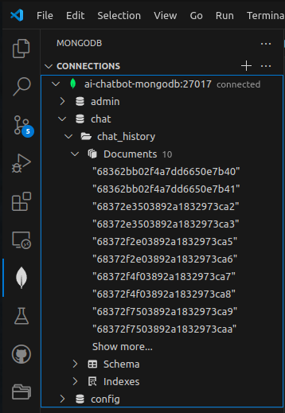

# Chatbot memory

## References
- [LangChain Essentials - Conversational Memory for OpenAI - LangChain](https://github.com/aurelio-labs/langchain-course/blob/main/chapters/04-chat-memory.ipynb)
- [MongoDBChatMessageHistory](https://python.langchain.com/docs/integrations/memory/mongodb_chat_message_history/)
- [Youtube - Long term memory & Self improving](https://www.youtube.com/watch?v=7LWTZqksmSg&ab_channel=AIJason)


## Requirements

Referring to past conversations, bringing up broader context.

Sample user prompts that should be supported:
- Can we go back to yesterday's conversation about ...
- Do you remember that idea we talked about some time ago? ...
- Remind me what things we were supposed to check in order to...
- Search the chat about ...
- Have we talked about this before?

## Implementation decisions

- Messages should be stored in a vector database to enable fast context retrieval for user queries.
- Converting message text to vector representation requires embeddings. For that OpenAI embeddings will be used but it should be possible to change embeddings provider in the future.
- Since the embeddings can change in the future the messages should also be stored in plain text so the conversion to vector form can be repeated at any time.
- For certain requirements the stored messages should include the following metadata: 
timestamp, voice file url,

## LangChain way of implementing message history storage
https://python.langchain.com/v0.2/docs/how_to/message_history/

### MongoDB
Initial implementation was done around [MongoDBChatMessageHistory](https://python.langchain.com/docs/integrations/memory/mongodb_chat_message_history/#usage) class to store chat message history in a Mongodb database.

Refer to: [app/chat_history.py](../app/chat_history.py)

Chat messages are stored as a separate documents in chat/chat_history collection in mongodb database.

Sample document looks like this:
```json
{
  "_id": {
    "$oid": "68362bb02f4a7dd6650e7b40"
  },
  "SessionId": "254751de-538a-463f-a8a9-b69bfac3e560",
  "History": "{\"type\": \"human\", \"data\": {\"content\": \"How do you do?\", \"additional_kwargs\": {}, \"response_metadata\": {}, \"type\": \"human\", \"name\": null, \"id\": null, \"example\": false}}"
}
```
Database can be browsed with vscode mongodb extension that is available within devcontainer.



### Vector database
How to store messages to both databases - regular and vector databases